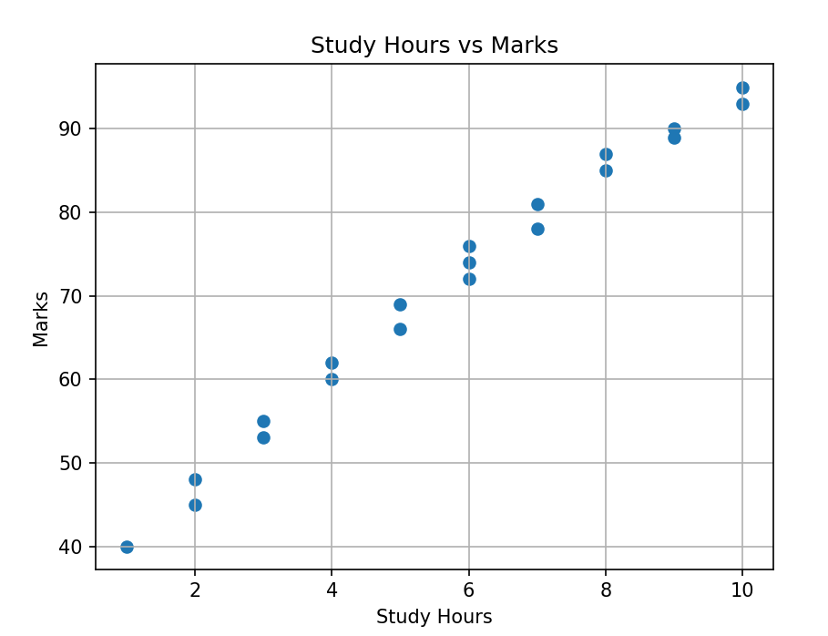
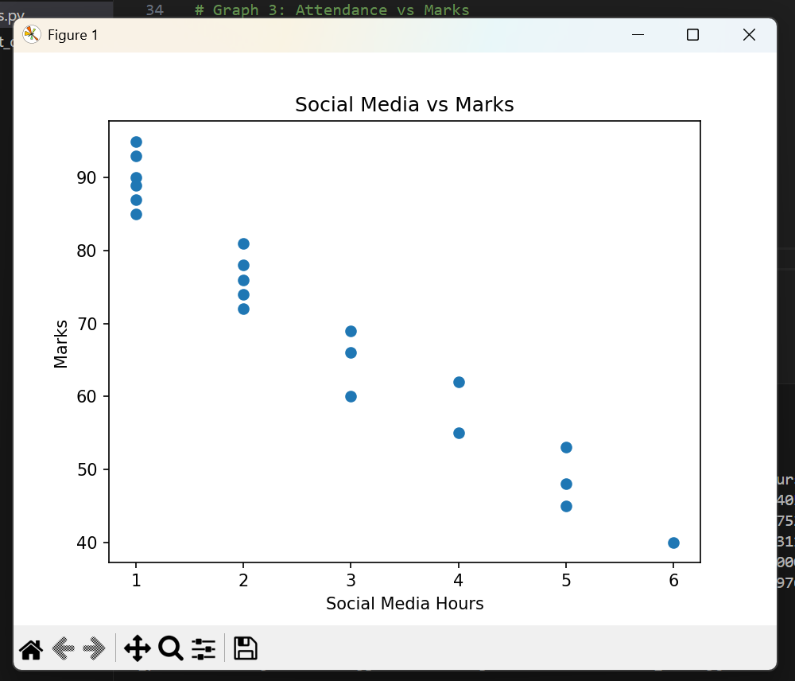
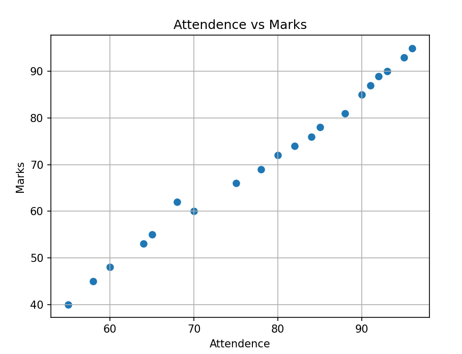
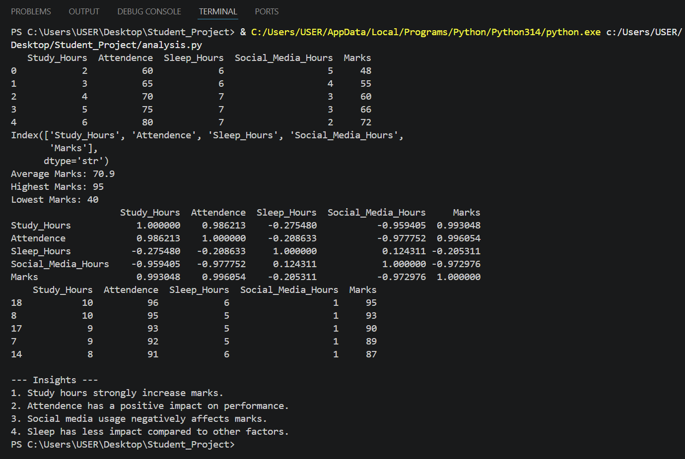

# Student Performance Analysis

## Objective
This project analyzes how factors such as study hours, attendance, sleep hours, and social media usage affect student marks.

## Tools Used
- Python
- Pandas
- Matplotlib

## Dataset Features
- Study_Hours
- Attendance
- Sleep_Hours
- Social_Media_Hours
- Marks

## Analysis Performed
- Data cleaning
- Removal of unwanted columns
- Basic statistical analysis
- Correlation analysis
- Top student identification
- Data visualization using scatter plots

## Key Findings
- Study hours have a strong positive impact on marks.
- Attendance has a positive impact on academic performance.
- Social media usage negatively affects marks.
- Sleep hours have less impact compared to other factors.

## Output
The project generates:
- Statistical summary
- Correlation matrix
- Top 5 students
- Scatter plots for:
  - Study Hours vs Marks
  - Social Media Hours vs Marks
  - Attendance vs Marks

## Conclusion
Student performance is strongly influenced by study habits and attendance, while excessive social media usage negatively affects marks.

## Files in this Repository
- `analysis.py` → Python code for analysis
- `student_data.csv` → Dataset used in the project

- ## Output Screenshots

### Study Hours vs Marks

### Social Media vs Marks

### Attendance vs Marks

### Terminal Output

