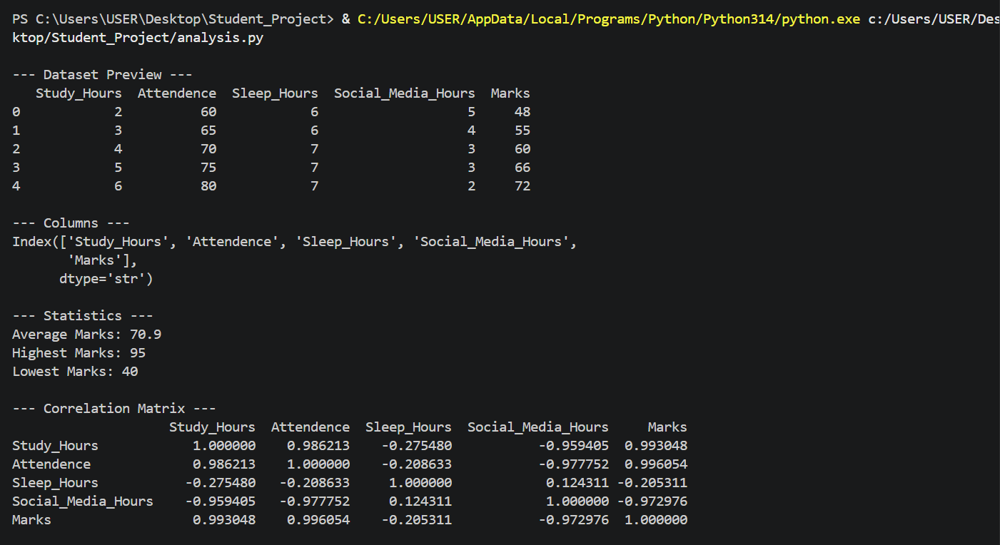
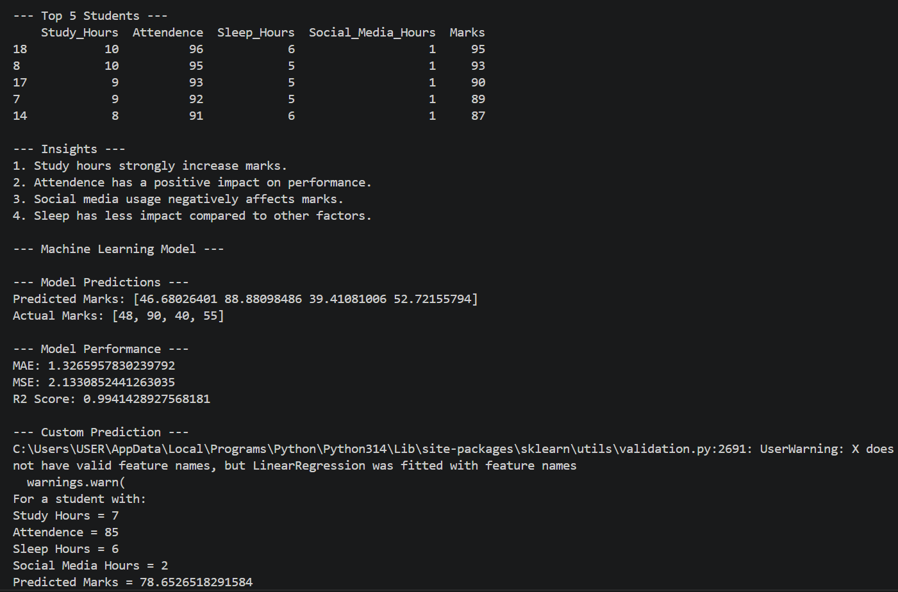

# 📊 Student Performance Analysis

## 📌 Objective
This project analyzes how factors such as study hours, attendance, sleep hours, and social media usage affect student marks.  
It also uses Machine Learning to predict student performance.

---

## 🛠️ Tools Used
- Python
- Pandas
- Matplotlib
- Scikit-learn

---

## 📂 Dataset Features
- Study_Hours  
- Attendance  
- Sleep_Hours  
- Social_Media_Hours  
- Marks  

---

## 🔍 Analysis Performed
- Data cleaning (removed unnecessary columns)
- Statistical analysis (mean, max, min)
- Correlation analysis
- Data visualization using scatter plots
- Identification of top-performing students

---

## 📈 Visualizations

### Study Hours vs Marks

### Social Media vs Marks

### Attendance vs Marks

---

## 🧠 Key Insights
- Study hours strongly increase marks.
- Attendance has a positive impact on performance.
- Social media usage negatively affects marks.
- Sleep has less impact compared to other factors.

---

## 🤖 Machine Learning Model

A **Linear Regression model** is used to predict student marks based on:

- Study Hours  
- Attendance  
- Sleep Hours  
- Social Media Usage  

---

## 📊 Model Performance

- MAE (Mean Absolute Error): **1.32**  
- MSE (Mean Squared Error): **2.13**  
- R2 Score: **0.99**  

👉 The model performs very well and predicts marks with high accuracy.

---

## 🔮 Sample Prediction

For a student with:
- Study Hours = 7  
- Attendance = 85  
- Sleep Hours = 6  
- Social Media Hours = 2  

👉 **Predicted Marks ≈ 78.65**

---

## 🖥️ Output Screenshots

### Output Part 1

### Output Part 2

---

## 🚀 Conclusion
This project demonstrates how data analysis and machine learning can be used to understand student behavior and predict academic performance effectively.

